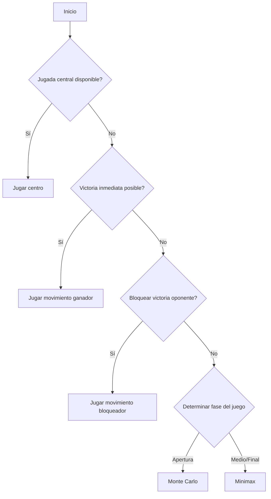

# Hex-Game

 > Joel Aparicio Tamayo C-312


## Visión General
Estrategia híbrida que combina:
- **Búsqueda adversarial** (Minimax con poda alfa-beta)
- **Simulaciones Monte Carlo**
- **Heurísticas basadas en distancia de caminos**
- **Detección de victorias/derrotas inminentes**

## Algoritmos Clave

### 1. Toma de Decisión Principal (`play()`)
```python
def play(self, board: HexBoard) -> tuple[int, int]:
    # Secuencia lógica de decisiones
    1. Jugada central inicial
    2. Verificación de victoria inmediata
    3. Bloqueo de victoria oponente
    4. Selección de estrategia según fase del juego:
       - Monte Carlo para aperturas (tableros grandes > 50% vacíos)
       - Minimax para medio juego y finales

def minimax(...):
    # Características principales:
    - Búsqueda en profundidad limitada
    - Ordenamiento de movimientos por proximidad al centro
    - Evaluación heurística personalizada
    - Poda alfa-beta para optimización
    
    Parámetros clave:
    - depth: límite de profundidad calculado dinámicamente
    - level_parity: control de turnos (max/min)
    - alpha/betha: mecanismo de poda

def monte_carlo_method(...):
    # Implementación:
    - Simulaciones aleatorias (1000-2000 iteraciones)
    - Evaluación mediante simulación rápida
    - Selección basada en ratio victorias/intentos
    - Profundidad adaptativa según tamaño del tablero

def heuristic(...) -> int:
    Calcula diferencia entre:
    - Camino mínimo del jugador (self.player_id)
    - Camino mínimo del oponente (3 - player_id)
    
    Prioridades:
    1. Victoria inmediata (return inf)
    2. Bloqueo de derrota (return -inf)
    3. Ventaja posicional (diferencia positiva)

def calculate_depth_limit(...) -> int:
    # Lógica:
    - Profundidad base: 3
    - Incremento según % de tablero ocupado
    - Profundidad infinita si < 10 movimientos restantes

@staticmethod
def shortest_path(...) -> int:
    Algoritmo tipo BFS adaptado:
    - Nodos iniciales: borde correspondiente al jugador
    - Peso de casillas vacías: 1
    - Peso de casillas propias: 0
    - Direcciones de movimiento hexagonales (6 vecinos)
```

